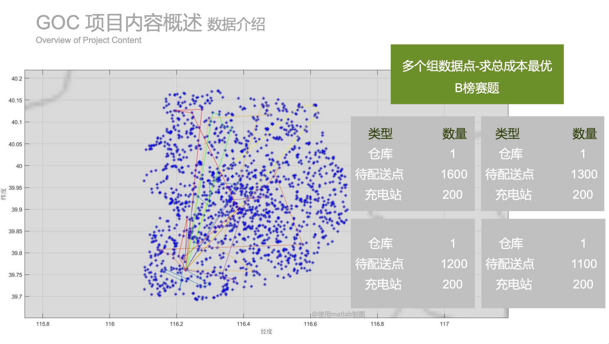

# 城市物流运输车辆智能调度

## JD Logistics Scheduling (GOC)


Author: Xiping.Yu

Email: [Amoiensis@outlook.com](mailto:amoiensis@outlook)

Data: 2019.09.11 - 2024.07.03


### Brief [概述]

​	项目为 **2018年 京东 JDATA-GOC物流运输车智能调度的解决方案 (B榜排名38, A榜64)**,  使用 近领域搜索启发式方法 构建初始解. 后续可使用其他方法在初始解进行提升，**如果您有基于本项目的改善或进一步开发，欢迎贡献和提交您的代码和思路**。


除问题解决方案外，同时也**提供以下内容**：

1. 提供 <u>**京东 JD GOC物流运输车智能调度的解决方案**</u>.

   ```
   - 求解工程项目
   	JD_v2.6_路线_含优化+注释+数据（可以调节参数，分别求解A/B赛题）
   - 赛题规模
   	- A榜: 送货+可充电+循环取货(单仓)
   	- B榜: 取货/送货+可充电+循环取货(单仓)
   	[Note]. A 即A榜只考虑Receiver_Node(待配送点), 不考虑 Sender_Node (待取货点).
     | ID_data_set | All_Node_Num |  Receiver_Node | Sender_Node | Charger_Node |
     | ----------- | ------------ | -------------- | ----------- | ------------ |
     | 5           | 1200         | 900            | 200         | 100          |
     | 4           | 1300         | 1000           | 200         | 100          |
     | 3           | 1400         | 1100           | 200         | 100          |
     | 2           | 1500         | 1200           | 200         | 100          |
     | 1           | 1600         | 1300           | 200         | 100          |
   - 项目说明
   	该项目 使用Dev C++, 作为IDE管理项目, 可简单修改后使用其他工具编辑和编译.
   - 算法思路
   	该项目, 为近领域搜索的启发式方法 构建初始解. 后续可使用其他方法在初始解进行提升.
   ```

   

2. 提供<u>**["路线结果检测工具"]()，可供老师安排该项目给学生作为课程项目，并可以轻松实现验证工作**</u>。

   [note.] 检测工具起源于 厦门大学 [陶继平](https://jptao.xmu.edu.cn) 老师 “高等运筹学“ 课程项目.

   [>> 结果检测软件=使用说明点这里✨.](https://github.com/Amoiensis/JD-Logistics-Scheduling-GOC/blob/master/Results-feasibility-test/JD路线检测%20使用说明.pdf)

   

3. 提供 <u>**赛题描述**</u>.

   [note.] 因原网站关闭，提供部分可找到的描述信息.

   [>> 赛题描述/说明=点这里✨.](https://github.com/Amoiensis/JD-Logistics-Scheduling-GOC/tree/master/Description)

   

4. 提供比赛 **<u>[[A榜-数据]](./Data)/ [[B榜-数据]](./Data) 赛题 数据.</u>**

   因原赛题网站 [[JDATA-GOC 城市物流运输车辆智能调度]](https://jdata.jd.com/html/detail.html?id=5)已关闭，为便于 VRP 的学术研究，同时为保护隐私，提供去除坐标点经纬度的数据，具体见“数据说明./Data”。

   ```
   [Note.]
   1. 如有需要带经纬度数据的数据, 请叙述研究使用原因等, 邮件联系 [Xiping.Yu](mailto:Amoiensis@outlook.com).
   2. 若为研究 HSODM(Homogeneous Second-Order Descent Method ) 的相关, 也可联系我们.
   ```


### Result [结果&排名]

#### 求解结果

```
A榜
	- 成本: 300987.06
	- 排名: 64
B榜
	- 成本: 40839.07
	- 排名: 38
```


### Structure [项目结构]

```
- JD_v2.6_路线_含优化+注释+数据
	- 求解项目代码存储.
	
- Results-feasibility-test
	- 路线结果检测程序 (路线需结构化输出).
	
- Data
	- 存储 A榜/B榜 赛题数据.
	
- Description
	- 部分赛题说明存储.

- Report
	- 部分报告存储.

- Picture
	- 涉及的部分图片.
```


### Description [赛题说明]

#### 来源


赛题官网（A/B题）

[JDATA](https://jdata.jd.com/index.html)----[GOC 城市物流运输车辆智能调度](https://jdata.jd.com/html/detail.html?id=5)

[Note.] 该网页已被关闭.


#### 大赛背景

智慧物流对提升消费体验和运营效率的作用越来越显著，而人们不断增长的需求和企业运营压力也给智慧物流发展提出更高的要求。以京东物流为例，城市A的城配物流中心B目前平均每天为分布在本城区的1000余个客户提供城市配送服务，服务对象为B2B或者大宗商品客户,每个服务对象有时效（时间窗）要求，每个车辆有容积和载重限制，车辆还需要充电，可往返配送中心，每天8点从城市配送中心出发，24点前返回本配送中心等。如何在满足各种因素限制的前提下，实现物流降本增效显得尤为重要，随着计算性能的提高，这类NP-Hard问题通过优化算法相关技术可以获得较好的解决。


#### 问题描述

京东物流城市A的城配物流中心B目前平均每天为分布在本城区的1000余个客户提供城市配送服务，服务对象为B2B或者大宗商品客户,运力资源充足,期望综合各种因素使得综合成本(包括运输成本、等待成本、充电成本和固定使用成本)最低。


#### 比赛简介

赛题共分为A、B两部分，B赛题在A赛题基础上加如城市客户寄件需求，其余条件与目标和A题一致。

**<u>[注] 京东原赛题，不允许使用商业求解器(Cplex/ Gurobi/ MindOPT/ COPT, etc)，且求解时间限制为5分钟。</u>**


#### 项目存储位置

[Github](https://github.com/Amoiensis/JD_Logistics_Scheduling): https://github.com/Amoiensis/JD_Logistics_Scheduling


#### 数据可视化




### Citation [引用]

如果本项目帮助到了您的研究，或者使用了本项目提供的数据，可以引用本项目，非常感谢！

```
@misc{Xiping2018,
  author = {Xiping.Yu},
  title = {JD-Logistics-Scheduling-GOC},
  year = {2018},
  publisher = {GitHub},
  journal = {GitHub repository},
  howpublished = {\url{https://github.com/Amoiensis/JD-Logistics-Scheduling-GOC}},
  commit = {}
}
```


### Attention [注意]

未经允许，请勿转载！本项目所有文件仅供学术研究使用！

如果有学术研究需求，和其他商业需求，请邮件联系 [Xiping.Yu](mailto:amoiensis@outlook.com).

Please do not reprint without permission! All files in this project are for academic research only!

If you have academic research needs or other commercial needs, please contact [Xiping.Yu](mailto:amoiensis@outlook.com).
